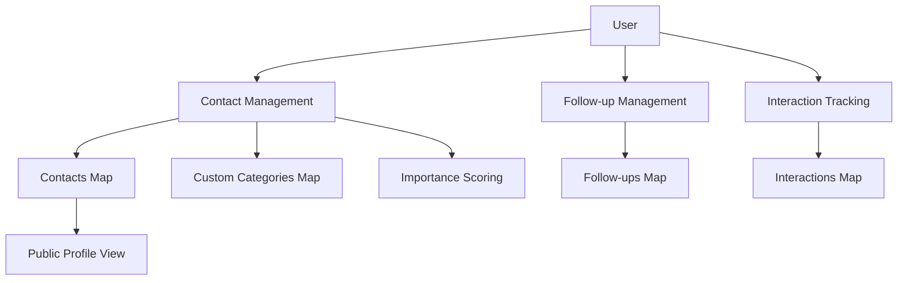

# BrightLink Professional Network

A decentralized professional networking platform built on the Stacks blockchain that empowers users with complete control over their professional connections and networking data.

## Overview

BrightLink enables professionals to manage their network connections in a secure, self-sovereign manner. Unlike traditional networking platforms that centralize and monetize user data, BrightLink puts users in control of their professional relationships while providing powerful tools for relationship management.

### Key Features
- Self-sovereign contact management
- Custom relationship categorization
- Follow-up scheduling and reminders
- Interaction history tracking
- Relationship scoring system
- Privacy-focused contact sharing

## Architecture

BrightLink is built around a core smart contract that manages professional connections and related data structures. The system uses a series of data maps to store contacts, categories, follow-ups, and interaction histories.



### Core Components
- **Contacts**: Stores professional contact information with privacy controls
- **Categories**: Supports both standard and custom relationship categories
- **Follow-ups**: Manages scheduled reminders and networking tasks
- **Interactions**: Records relationship history and engagement
- **Importance Scoring**: Helps prioritize network relationships

## Contract Documentation

### brightlink-core.clar

The main contract implementing BrightLink's functionality.

#### Key Data Structures
- `contacts`: Stores contact profiles and relationship metadata
- `custom-categories`: Manages user-defined relationship categories
- `follow-ups`: Tracks scheduled networking tasks
- `interactions`: Records networking history

#### Access Control
- All functions are user-scoped, ensuring data privacy
- Public profile sharing is optional and controlled by contact owners

## Getting Started

### Prerequisites
- Clarinet
- Stacks wallet for deployment/testing

### Installation
1. Clone the repository
2. Install dependencies with Clarinet
3. Deploy contracts to testnet or mainnet

### Basic Usage

```clarity
;; Add a new contact
(contract-call? .brightlink-core add-contact 
    "John Doe"
    "CEO"
    "Tech Corp"
    "john@example.com"
    "+1234567890"
    "San Francisco"
    u1
    none
    u8
    "Met at tech conference")

;; Schedule a follow-up
(contract-call? .brightlink-core schedule-follow-up
    u1
    (+ block-height u1000)
    "Quarterly catch-up"
    "Discuss partnership opportunities")
```

## Function Reference

### Contact Management

```clarity
(add-contact name title company email phone location category public-profile importance-score notes)
(update-contact contact-id name title company email phone location category public-profile importance-score notes)
(delete-contact contact-id)
```

### Follow-up Management

```clarity
(schedule-follow-up contact-id due-date title description)
(complete-follow-up follow-up-id)
(update-follow-up follow-up-id due-date title description)
```

### Interaction Tracking

```clarity
(record-interaction contact-id type notes outcome)
(update-interaction interaction-id type notes outcome)
```

## Development

### Testing
Run the test suite using Clarinet:
```bash
clarinet test
```

### Local Development
1. Start Clarinet console:
```bash
clarinet console
```
2. Deploy contracts and interact using the console

## Security Considerations

### Data Privacy
- Contact information is only accessible to the owner
- Public profiles are opt-in only
- All data operations are scoped to the caller's principal

### Limitations
- Contact data is stored on-chain and is therefore permanent
- Public profile sharing requires careful consideration of privacy implications
- Follow-up scheduling depends on block times for timing accuracy

### Best Practices
- Regularly review shared contact permissions
- Use importance scoring to maintain focused networking
- Keep sensitive information in off-chain storage
- Validate all input data before submission